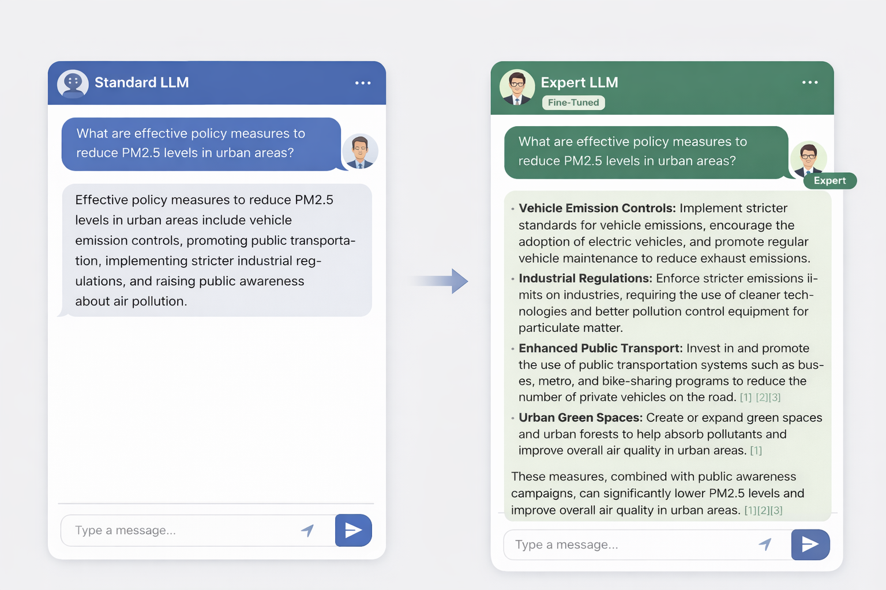

# Policy-Aware LLM for Air Quality & Decision Support

## Overview

This project aims to develop a **policy-specialized large language model (LLM)** that supports **air quality analysis and decision-making** by integrating:

* Public policy documents (government, international organizations)
* Scientific literature (e.g., arXiv)
* Air quality data sources (e.g., OpenAQ, GEOS-based outputs)

The system is designed to bridge **Data → Retrieval → Reasoning → Policy Recommendation**, enabling:

* Context-aware interpretation of PM2.5 and AQI
* Policy-oriented responses with structured reasoning
* Integration with interactive dashboards and chatbot interfaces

---

## Model Comparison
Standard LLM vs Policy-aware Expert LLM


---

## Objectives

* Build a **domain-adapted LLM** for environmental policy applications
* Evaluate **RAG vs Fine-tuning approaches**
* Develop an **end-to-end pipeline** from document ingestion to chatbot deployment
* Provide a reproducible framework for **policy-aware AI systems**

---

## Key Features

* Document ingestion from:

  * Government websites
  * International organization reports
  * Open-access research papers
* Automated preprocessing:

  * HTML/PDF parsing
  * Text cleaning
  * Chunking

* Dataset construction:

  * Instruction / QA generation from documents
* Model training:

  * LoRA / QLoRA-based fine-tuning on Llama models
* Deployment:

  * Local inference engine
  * Chatbot API integration (FastAPI)

* Retrieval-Augmented Generation (RAG)
  * Documents → embeddings
  * Stored in vector DB
  * Query → embedding →similarity search

* Fine-tuning
  * Input-output training pairs
  * Updates model weights
  * Contorols behavior and style

---

## System Architecture

```text
                ┌────────────────────────┐
                │  Public Documents      │
                │ (Gov / Reports / arXiv)│
                └────────────┬───────────┘
                             │
                             ▼
                ┌────────────────────────┐
                │  Data Collection       │
                │  (Crawler / API)       │
                └────────────┬───────────┘
                             │
                             ▼
                ┌────────────────────────┐
                │  Preprocessing         │
                │  - Cleaning            │
                │  - Chunking            │
                └────────────┬───────────┘
                             │
          ┌──────────────────┴──────────────────┐
          │                                     │
          ▼                                     ▼
┌────────────────────────┐          ┌────────────────────────┐
│  Vector DB (RAG)       │          │ Dataset Construction   │
│  - Embeddings          │          │ (QA / Instruction)     │
│  - Similarity Search   │          └────────────┬───────────┘
└────────────┬───────────┘                       │
             │                                   ▼
             │                      ┌────────────────────────┐
             │                      │ Fine-tuning (LoRA)     │
             │                      │ Llama-based model      │
             │                      └────────────┬───────────┘
             │                                   │
             └──────────────┬────────────────────┘
                            ▼
                ┌────────────────────────┐
                │  Inference Layer       │
                │  (LLM + Retrieved Data)│
                └────────────┬───────────┘
                             │
                             ▼
                ┌────────────────────────┐
                │ Chatbot / Dashboard    │
                └────────────────────────┘
```

---

## Repository Structure

```text
policy_llm_project/
├─ data/
│  ├─ raw/
│  ├─ processed/
│  └─ eval/
├─ configs/
│  ├─ sources.yaml
│  ├─ cleaning.yaml
│  └─ finetune.yaml
├─ src/
│  ├─ collectors/
│  ├─ preprocess/
│  ├─ dataset/
│  ├─ finetune/
│  ├─ serve/
│  └─ utils/
├─ scripts/
│  ├─ run_collect.py
│  ├─ run_preprocess.py
│  ├─ run_build_dataset.py
│  ├─ run_train.py
│  └─ run_serve.py
├─ requirements.txt
└─ README.md
```

---

## Pipeline

The system supports **two complementary pipelines**:
- **RAG (Retrieval-Augmented Generation)** → dynamic knowledge retrieval  
- **Fine-tuning** → domain-specific reasoning and response formatting  

These pipelines can be used independently or combined.

---

### Step 1: Data Collection

Collect documents from:

* Government websites
* Policy reports (PDF)
* Scientific sources (e.g., arXiv API)

```bash
python scripts/run_collect.py
```

---

### Step 2: Preprocessing

* Extract text (HTML / PDF)
* Clean and normalize
* Remove noise
* Standardize formats

```bash
python scripts/run_preprocess.py
```

---

### Step 3: Chunking

Split documents into manageable chunks for.
* Embedding (RAG)
* Training dataset (fine-tuning)
---

## RAG Pipeline (Vector-Based Retrieval)
### Step 4a: Embedding & Vector Database 
* Convert text chunks → embeddings
* Store in vector database (FAISS / Chroma / etc.)
* Enable similarity search

```bash
python scripts/run_rag.py
```

---

### Step 5a: Retrieval at Interference Time 
* User query → embedding
* Retrieve top-k similar documents
* Inject retrieved context into LLM

---

## Fine-tuning Pipeline (Model Adaption)
### Step 4b: Data Construction 
Generate instruction-style or QA-style training data:
* Input → Output pairs
* Policy-aware responses
* AQI interpretation rules
 
```bash
python scripts/run_build_dataset.py
```

---
### Step 5b: Fine-tuning
Train a Llama-based model using LoRA / QLoRA:
 
```bash
python scripts/run_train.py
```
---

### Step 6: Inference / Chatbot

Combine both approaches.
* RAG → provides up-to-date knowledge
* Fine-tuned LLM → provides structured reasoning and response style
  
```bash
python scripts/run_serve.py
```

---

## Tech Stack

* **Language**: Python
* **LLM**: Llama (fine-tuned with LoRA / QLoRA)
* **Training**: Hugging Face Transformers, PEFT, TRL
* **Data Processing**: BeautifulSoup, PyMuPDF
* **API**: FastAPI
* **Optional**: vLLM / llama.cpp
* **Data Sources**: OpenAQ, government datasets, scientific literature

---

## Experiment Design

This project compares three approaches:

### 1. Baseline LLM

* No fine-tuning
* No retrieval

### 2. Fine-tuned LLM

* Domain-adapted using policy documents

### 3. RAG + Fine-tuned LLM 

* Retrieval for up-to-date knowledge
* Fine-tuning for response structure and reasoning

---

## Example Use Cases

* "What is the current air quality near me?"
* "Compare PM2.5 trends between two cities over 10 years"
* "What policy recommendations apply under high AQI conditions?"
* "Summarize key findings from a policy report"

---

## Demo (Coming Soon)

* Chatbot interaction (AQI + recommendation)
* Dashboard visualization (time-series, comparison)
* Policy-aware response generation

---

## Important Notes

* Only collect data from:

  * Publicly available sources
  * Documents with permitted usage
* Always verify:

  * Terms of Service
  * Licensing conditions
* This project is intended for **research and prototyping purposes**

---

## Future Work

* Improved QA dataset generation (semantic parsing, LLM-assisted labeling)
* Integration with real-time AQI APIs
* Multi-modal support (maps, satellite data)
* Policy evaluation metrics (explainability, uncertainty)
* Deployment optimization (low-latency inference)

---

## Author

Junhyun Seo
Assistant Research Scientist
NASA Goddard Space Flight Center (GESTAR II)

---

## License

TBD
